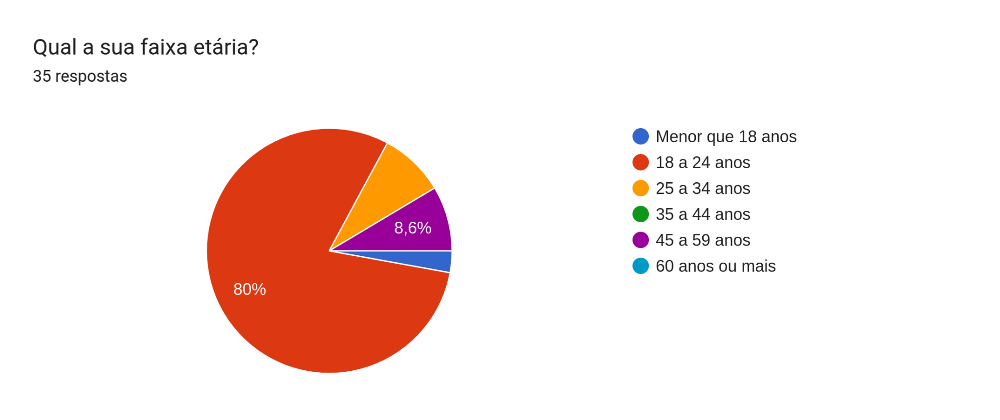
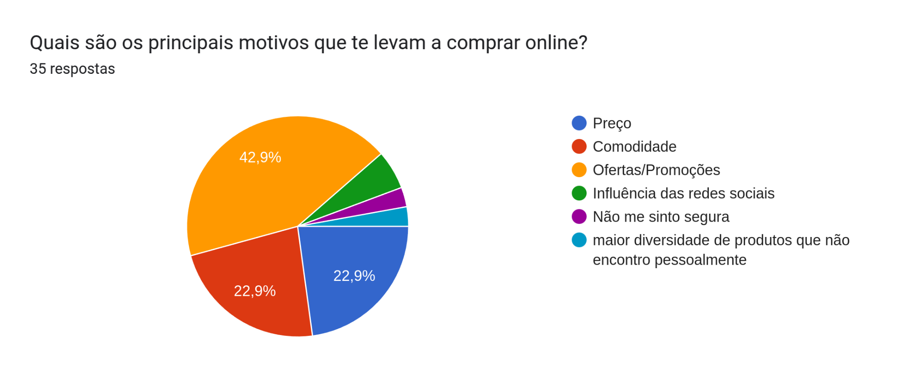
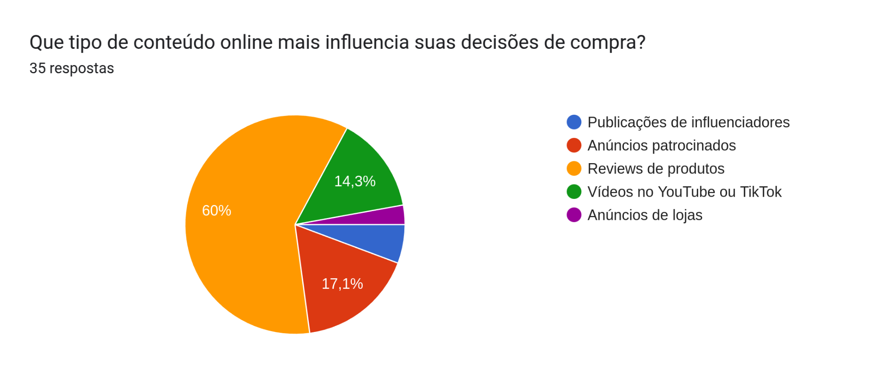
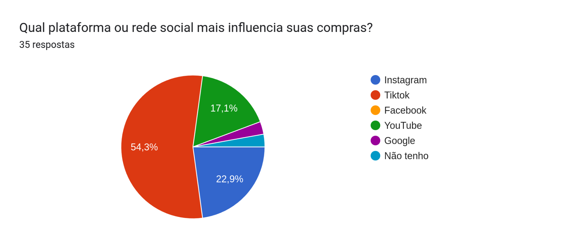
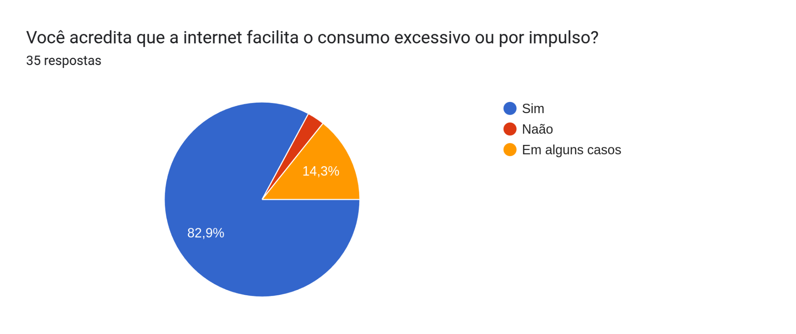

## **5\. Resultados**

A Partir dos dados coletados foi-se feito uma análise comparativa e exclusivamente interpretada para esta amostra de população, os dados não refletem a realidade generalista mas sim uma pequena parte que foi pesquisada, assim podemos apenas fazer conclusões em uma pequena porção da realidade consumista.

Gráfico: Idade Predominante.

A maior parte dos entrevistados se categorizam na faixa dos 18 a 24 anos, o que pode se justificar por meio de que os jovens possuem mais facilidade e familiaridade com os meios digitais, além de que as transações online geram parte de desconfiança de pessoas mais velhas.

 Gráfico: Motivo de compra.

Podemos observar que dois fatores são mais predominantes quando na decisão de fazer uma compra online, o preço (Categoria Preço e Ofertas/Promoções \- 65.8%) que se torna mais atrativo que as lojas físicas e a praticidade de por comprar sem sair de casa (Comodidade \- 22.9% ).

Gráfico: Influencia na Compra.

A opinião sobre um produto é altamente levada em consideração na hora de se fazer uma compra online, assim como é possível observar na grande quantidade dos influencer digitais e suas propagandas, seja por meio de stories ou a narrativa de agregar o produto no cotidiano, passando a impressão da necessidade daquele produto;

Gráfico: Plataformas e Rede Social.

Com grande participação no cotidiano, as redes sociais são responsáveis por grande parte da propagação de propagandas, o TikTok e o Instagram com seus formatos de vídeos rápidos e curtos, bombardeiam o usuário com produtos e anúncios curtos e chamativos com alta frequência.

Gráfico: Consumo por impulso.

A maior parte acredita que a internet facilita o consumo excessivo.
