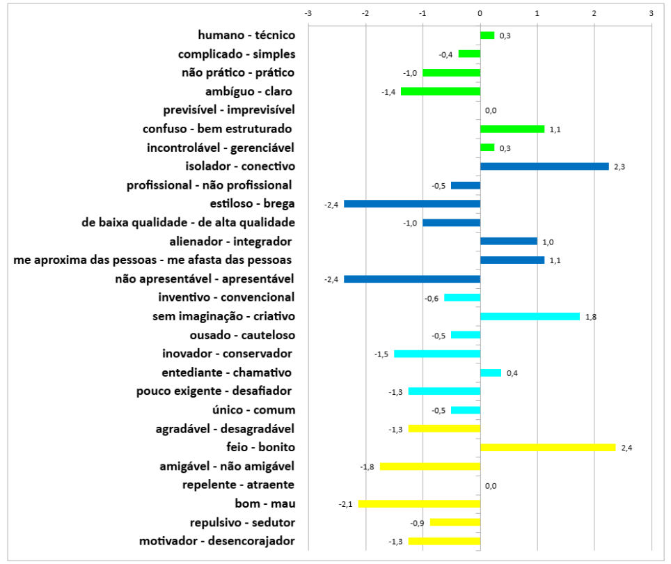

# AtrakDiff

Os resultados da avaliação pelo método AttrakDiff indicam que a plataforma Rave é percebida como mais técnica e menos “humana”, com uma interface que, embora moderna e criativa, pode gerar confusão e dificultar o uso para alguns usuários. Essa complexidade afeta a sensação de conforto e pode limitar a vontade dos usuários de convidar outras pessoas para interações colaborativas, impactando a experiência social e emocional. No entanto, o Rave se destaca por oferecer uma experiência inovadora, criativa e envolvente, com recursos que estimulam o engajamento e proporcionam prazer durante o uso.

Já o Kosmi apresenta uma interface mais simples e “humana”, com uma linguagem acessível que facilita a usabilidade para muitos usuários. Por outro lado, essa simplicidade pode ser interpretada como falta de maturidade da plataforma, transmitindo uma sensação de incompletude. Além disso, problemas relacionados à clareza das funções e à segurança, como a possibilidade de entrada anônima, geram insegurança e reduzem a confiança dos usuários, afetando negativamente a experiência colaborativa e o sentimento de pertencimento.

Em conjunto, os resultados mostram que, apesar de diferenças nas abordagens de design e usabilidade, ambas as plataformas conseguem promover conexões sociais e estimular sentimentos de proximidade entre os usuários. Todavia, desafios relacionados à clareza, praticidade e segurança impactam a satisfação emocional e o engajamento, demonstrando que aprimorar esses aspectos é fundamental para que as plataformas cumpram seu potencial como espaços de sociabilidade digital. Investir em melhorias na experiência do usuário não apenas torna o uso mais agradável, mas também fortalece o papel dessas ferramentas no suporte emocional e na promoção do bem-estar social em ambientes virtuais.